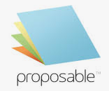

# awesome-bid-tender-rfp-tools
A curated list of tools for BID, RFP, RFI, RFQ and Tenders.

## Aggregation Tools

Logo | Tool | Description | Price | Link
--- | --- | --- | --- | ---
 | BidNet | BidNet aggregates federal, state, and local government RFPs from across the United States, delivering new contract opportunities daily. It includes market research on closed and awarded solicitations, providing insights for future proposals | --- | [Link](https://www.bidnet.com/)
 | The RFP Database (RFPDB) | Recently acquired by MyGovWatch.com, RFPDB offers a range of RFP, bid opportunities, and project offerings. It's a comprehensive source for various business service categories and construction projects | --- | [Link](https://www.rfpdb.com/)
 | BidSearch | This platform collects government bids and RFPs from federal, state, local, and educational organizations nationwide, including some Canadian provinces. It delivers these opportunities directly to your email inbox | --- | [Link](https://www.bidsearch.com/)
 | National Tenders | It offers a one-stop solution for various tendering platforms like GeM/nprocure/eProcure/IREPS, etc., providing services from consulting to execution | --- | [Link](https://www.nationaltenders.com/)
 | ProcurePort | A platform that streamlines the e-procurement process, offering significant cost savings and improved efficiency. It combines RFP, RFI, and RFQ into a single eRFX software | --- | [Link](https://www.procureport.com/)

## Sales Tools

Logo | Tool | Description | Price | Link
--- | --- | --- | --- | ---
 | PandaDoc | Beyond RFPs, it assists with proposals, quotes, and contract management, featuring a drag-and-drop document creator and native CRM integrations | Plans start at $19/month per user​ | ---
 | Proposable | Automates the entire proposal process and offers advanced analytics and document templates | Pricing starts at $19/month per user for the Solo plan | ---
 | Proposify | Tailored for creative firms, it provides enhanced content management, data security options, and analytics | The Team Plan is priced at $49/month per user​ | ---
 | Loopio | Ideal for sales teams, it features a centralized content library and integrates with tools like Salesforce. Pricing is available upon contacting sales | --- | ---